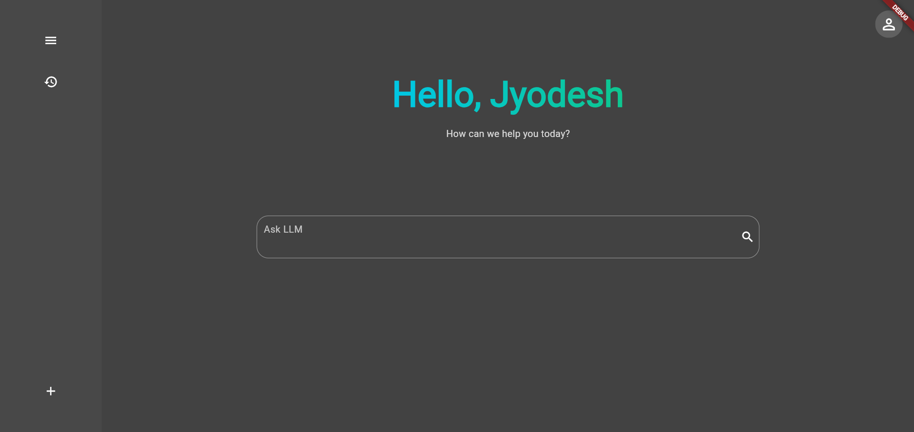
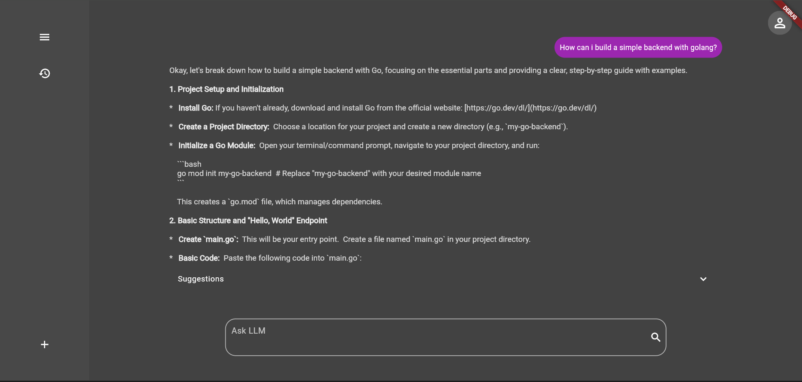
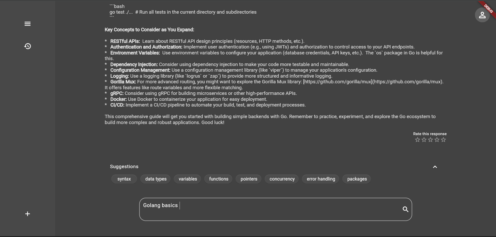

# HMI project.

Topic : How do prompt revision and assisted feedback mechanisms influence in improving output across diverse LLM-supported tasks?

[hmi-project-final.vercel.app/
](https://hmi-project-final.vercel.app/)

## Group Members:
* Mohammed Ruzhan Islam   (1615434)		mohammed.islam@stud.fra-uas.de
* Muhammad Humza Faqi     (1597350)     mohammad.faqi@stud.fra-uas.de
* Abdul Hanan Nawaz	 	  (1615054)		abdul.nawaz@stud.fra-uas.de
* Jyodesh Shakya	 	  (1613609)		jyodesh.shakya@stud.fra-uas.de

## Features

*   **Gemini API Integration:** 
*   **Cohere API Integration:** 
*   **Rate Output:** Users can rate the generated output.
*   **Live Suggestions:** Provides live suggestions as the user types.

## Screenshots

## Contributing

Contributions are welcome! Please open an issue or submit a pull request.
